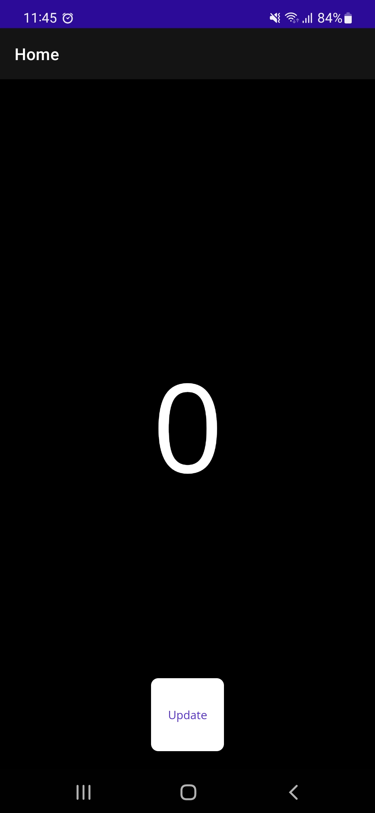
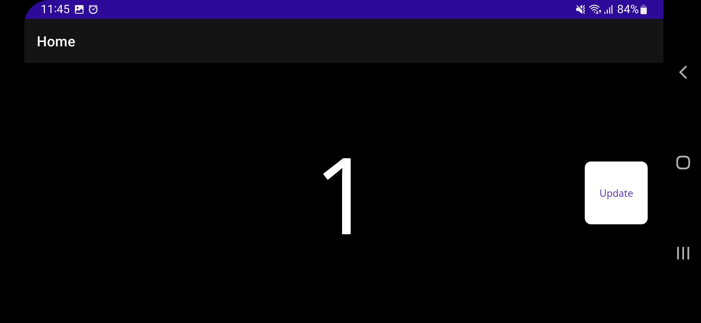
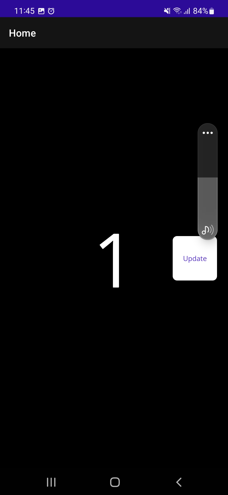
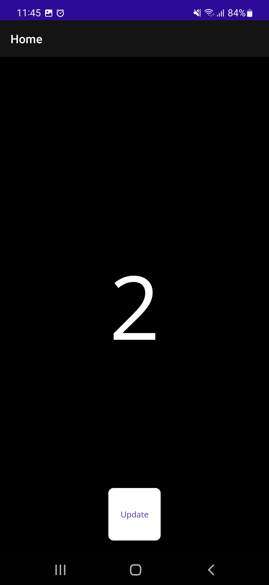

# dotnet-maui-bug-view-update

# Summary #

On Android, Views don't get updated (e.g. when changing layout or applying a VisualState) unless UI is interacted with or an observable property gets changed

This occurs, when trying to update the UI layout in response to a size change, e.g. by applying a VisualState when rotating the device.

**This only occurs on Android, on iOS it works fine.**

# Demo on Android #

**1. Starting the app in Portrait mode**



**2. Rotating into Landscape mode**

Note: The button should be on the right side now


**3. Press the Button**

Note: The button is on the right side now after pressing it



**4. Rotating back into Portrait mode**

Note: The button should be at the bottom again now



**5. Press the Button**

Note: The button is at the bottom again now after pressing it



# How to reproduce #

I have a layout that I am optimizing for Portrait and Landscape modes respectively.

When I rotate the device, I change some layout values, such as the `HorizontalOptions` and `VerticalOptions` of certain Views that I would like to reposition in response to the size change for which I have an overide of `OnSizeAllocated()`. I am using the **VisualStateManager** to update the layout, but I've encountered exactly the same issue when I manually set the values in the code-behind or via bindings.

The problem is that there seems to be a render cycle missing after updating the layout. The changes only get applied when I add some UI interaction, such as a button press that triggers a _PropertyChanged_ event on some property. This problem applies to all kinds of Views, such as Grids, StackLayouts, Labels and Buttons.

In the following example to reproduce the issue, there is a button that is centered at the bottom in Portrait mode and moved to the right hand-side when going into Landscape mode. The button only changes its position after pressing it instead of updating immediately:

**XAML**
```xml
<?xml version="1.0" encoding="utf-8" ?>
<ContentPage xmlns="http://schemas.microsoft.com/dotnet/2021/maui"
             xmlns:x="http://schemas.microsoft.com/winfx/2009/xaml"
             x:Class="MauiViewUpdateBug.MainPage">

  <ContentPage.Resources>
    <ResourceDictionary>
      <Style x:Key="ButtonStyle" TargetType="Button">
        <Setter Property="Margin" Value="20" />
        <Setter Property="VisualStateManager.VisualStateGroups">
          <VisualStateGroupList>
            <VisualStateGroup x:Name="CommonStates">
              <VisualState x:Name="Portrait">
                <VisualState.Setters>
                  <Setter Property="HorizontalOptions" Value="Center" />
                  <Setter Property="VerticalOptions" Value="End" />
                </VisualState.Setters>
              </VisualState>
              <VisualState x:Name="Landscape">
                <VisualState.Setters>
                  <Setter Property="HorizontalOptions" Value="End" />
                  <Setter Property="VerticalOptions" Value="Center" />
                </VisualState.Setters>
              </VisualState>
            </VisualStateGroup>
          </VisualStateGroupList>
        </Setter>
      </Style>
    </ResourceDictionary>
  </ContentPage.Resources>

  <Grid>

    <Label 
      x:Name="MyLabel"
      HorizontalOptions="Center"
      VerticalOptions="Center"
      Text="{Binding Clicks}"
      FontSize="150"/>

    <Button
      x:Name="MyButton"
      Text="Update"
      HeightRequest="80"
      WidthRequest="80"
      Clicked="MyButton_OnClicked"
      Style="{StaticResource ButtonStyle}"/>

  </Grid>

</ContentPage>
```

**Code-behind**
```c#
namespace MauiViewUpdateBug;

public partial class MainPage : ContentPage
{
    public int Clicks { get; set; }

    public MainPage()
    {
        InitializeComponent();
        BindingContext = this;
    }

    protected override void OnSizeAllocated(double width, double height)
    {
        base.OnSizeAllocated(width, height);

        VisualStateManager.GoToState(MyButton, width > height ? "Landscape" : "Portrait");
    }

    private void MyButton_OnClicked(object sender, EventArgs e)
    {
        Clicks++;
        OnPropertyChanged(nameof(Clicks));
    }
}
```
